# SplitMatrix50 取扱説明書
ご使用前に、この取扱説明書をお読みの上、正しく安全にお使いください。
最新の取扱説明書は、以下でご確認ください。
 

    <a href="https://github.com/misshii3/zmk-smatrix/blob/main/MANUAL.md">https://github.com/misshii3/zmk-smatrix/blob/main/MANUAL.md</a>

    

 

## 目次
- [1. 製品の外観イメージ、各部の名称](#sec-1)
- [2. 仕様](#sec-2)
- [3. 製品に含まれるもの](#sec-3)
- [4. 別途ご用意が必須なもの](#sec-4)
- [5. リチウムポリマー電池の選び方と注意事項](#sec-5)
- [6. セットアップ](#sec-6)
  - [6.1 スライドスイッチのON/OFF](#sec-6-1)
  - [6.2 リチウムポリマー電池の接続](#sec-6-2)
  - [6.3 キースイッチの取付け](#sec-6-3)
  - [6.4 キーキャップの取付け](#sec-6-4)
  - [6.5 PCに接続して動作を確認](#sec-6-5)
  - [6.6 ファームウェアビルド環境の作成](#sec-6-6)
  - [6.7 ファームウェアを書き込む](#sec-6-7)
  - [6.8 PCとの接続](#sec-6-8)
  - [6.9 KeymapEditorでキーマップ編集](#sec-6-9)
- [7. 注意事項](#sec-7)
- [8. 免責事項](#sec-8)

 

### 1. 製品の外観イメージ、各部の名称
写真に含まれるキーキャップ、キースイッチ、リチウムポリマー電池は、外観イメージを表すもので、製品には含みません。ご自身で別途ご用意が必要です。

    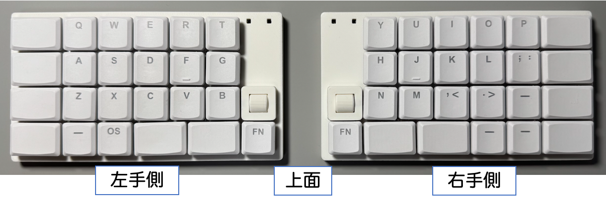
      
    
      
    
      
    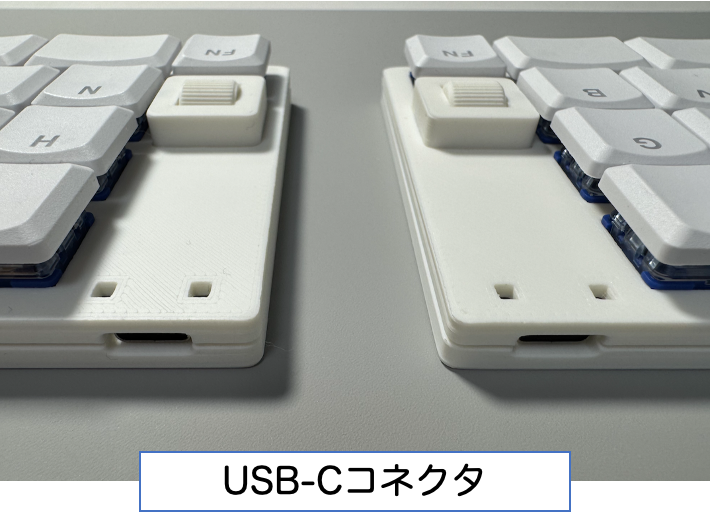
      
    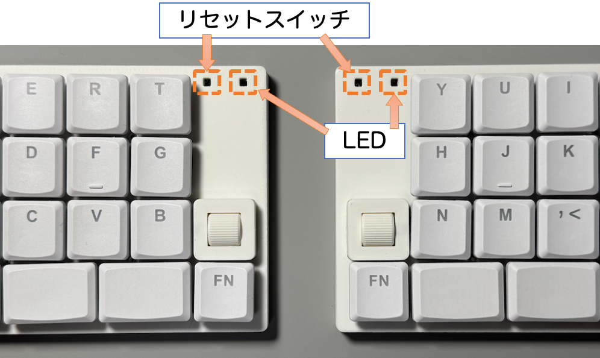
      
    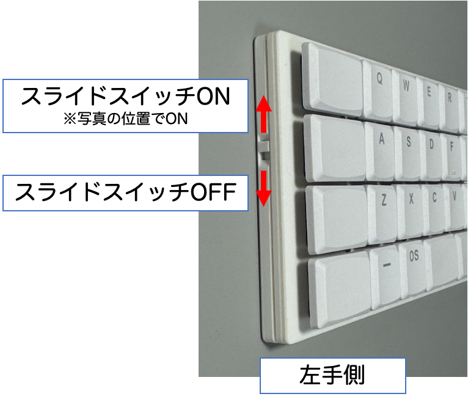
      
    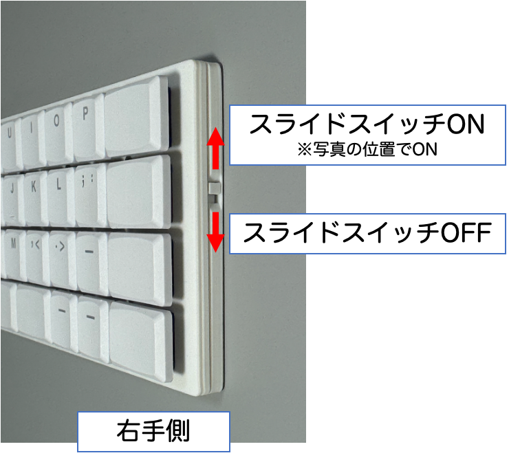

 

### 2. 仕様

|項目|内容|
|---|---|
|対応キースイッチ|Kailh Choc V2|
|対応キーキャップ|CherryMX互換ロープロファイルキーキャップ|
|推奨キーキャップ|THT(Tai-Hao Thins) Low Profile Keycaps MX 1U×36個、1.5U×12個|
|サイズ|縦:83mm 横:149mm 高さ:17mm（片方のみ、高さは推奨キーキャップ装着時）|
|参考重量|262g（キースイッチ・推奨キーキャップ・バッテリーを含む）|
|キーピッチ|19mm|
|キーボード本体のカラー|マットホワイト|
|無線方式・接続台数|Bluetooth5.0(Bluetooth Low Energy)、最大5台まで|
|内蔵マイコン|Seeed XIAO BLE nRF52840|
|ファームウェア|ZMKファームウェア|
|バッテリー持続期間|150mAhの場合、3〜4週間（利用状況により変化します）|
|バッテリー充電の入力|USB-C接続により充電。入力電圧：5V|
|その他|ボディやパーツは家庭用3Dプリンターで印刷しているため、積層痕や若干の個体差・表面の粗さ・埃の混入が生じます。|

 

### 3. 製品に含まれるもの
- キーボード本体（左手用、右手用を含む）
- 滑り止めシート（キーボード裏側への貼り付け用）
 

### 4. 別途ご用意が必須なもの
| 必須アイテム | 数量・仕様 |
|---|---|
| キースイッチ（Kailh Choc V2） | 48個 |
| CherryMX互換ロープロファイルキーキャップ | 1U×36個、1.5U×12個 |
| 3.7V リチウムポリマー電池 | 2個（実測で縦35mm以下、横18.5mm以下、厚み4mm以下、JST 1.25コネクタ付）   リチウムポリマー電池の選び方と注意点について後述した内容を必ず確認してください |
| USB-Cケーブル | 1本 |
| 精密プラスドライバー | 1本 |

 

### 5. リチウムポリマー電池の選び方と注意事項
- ポイント1. 大きさ\
  リチウムポリマー電池の大きさは「401730」のように記載されています。
  - 最初の2桁（40）＝厚み（0.1 mm単位）→ 4.0 mm
  - 次の2桁（17）＝幅（短辺, mm）→ 17 mm
  - 最後の2桁（30）＝長さ（長辺, mm）→ 30 mm\
   

  これを踏まえた、推奨サイズは以下となります。
  | リチウムポリマー電池 推奨サイズ | サイズ詳細 |
  |:---|:---|
  | 401730 | 厚み4.0mm, 幅17mm, 長さ30mm |
  

  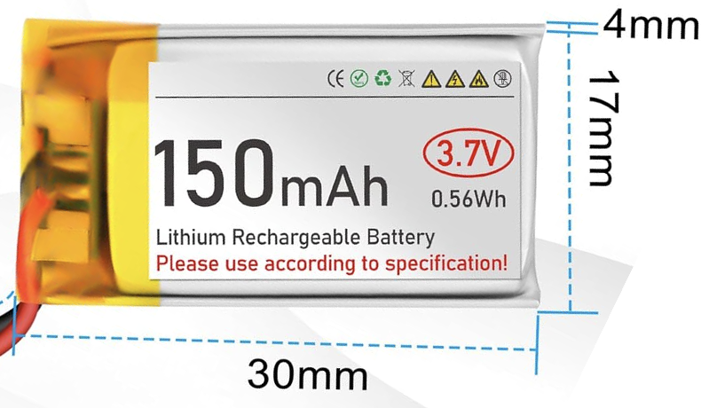

   

- **ポイント2. コネクタと極性**\
  キーボード基板上のコネクタに適合する規格は先述のとおり、JST 1.25mmと記載のものになります。\
  しかし、コネクタの規格自体が同じでもリチウムポリマー電池の極性が逆になっている場合があります（リチウムポリマー電池の商品説明や仕様と、実際に届いた現物の極性が異なる場合もあります）。\
  極性が逆の状態で接続すると故障、発熱、発火の原因となり極めて危険です。極性が確認できないものは危険ですので絶対に接続しないでください。\
  もしも極性が逆になっているリチウムポリマー電池を購入した場合でも、ご自身による改造や極性の変更は、危険ですので絶対に行わないでください。\
  初回接続および毎回接続を行う前に、必ず正しい配線になっているか十分に確認してから接続してください。
  

    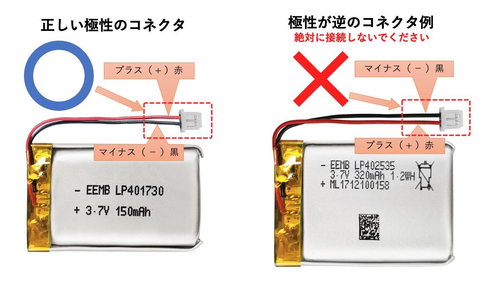
  

 

----

# 6. セットアップ

## 6.1 スライドスイッチのON/OFF
- 使用する際は、スライドスイッチをONにしてください。
- 使用後は、スライドスイッチをOFFにしてください。

## 6.2 リチウムポリマー電池の接続
- **【注意事項】**
  - あらかじめ、[5. リチウムポリマー電池の選び方と注意事項](#sec-5)を必ず確認してください。
  - JST 1.25コネクタの極性がキーボードと一致していることを必ず確認してください。
  - 極性が不明・逆の電池は接続しないでください。改造や極性の入れ替えは行わないでください。
  - 発熱・異臭・煙・異音などの異常を感じたら直ちに接続を外し、使用を中止してください。
 

1. **USBケーブルを外してください**
 

2. **スライドスイッチをOFFにしてください。**
 

3. 底面ネジを全て外し、底面ボディを外し、基板の裏側が見える状態にしてください。
 

4. リチウムポリマー電池の接続
 
   

     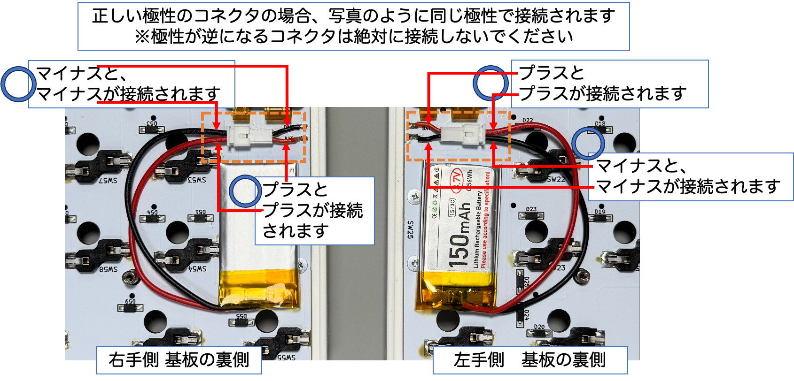
   

 

5. **スライドスイッチをONにする前に短絡(配線のショート)がないか確認してください。(特にJSTコネクタ周り)**
 

6. **スライドスイッチをONにしてください。**
 

7. **スライドスイッチをONにした後、必ず、部品の発熱・異臭・煙・短絡がないか確認してください。**
 

8. 底面ボディを取り付ける際、ネジ締めでリチウムポリマー電池のケーブルが挟まれないように注意しながら、底面ネジを全て取り付けてください。

 

## 6.3 キースイッチの取付け
- スライドスイッチをOFFにして、別途ご用意頂いたキースイッチ（Kailh Choc V2）を取り付けてください。
  - 左手側：24個
  - 右手側：24個

## 6.4 キーキャップの取付け
- スライドスイッチをOFFにして、別途ご用意頂いたCherryMX互換ロープロファイルキーキャップを外観イメージを参照し、取り付けてください。
  - 左手側：1U×18個、1.5U×6個
  - 右手側：1U×18個、1.5U×6個
  

## 6.5 PCに接続して動作を確認
- ファームウェアを初めて書き換える前に、PCと接続してキー入力が行えるか、動作確認をお願いします。
- キーボードにはデフォルトのキーマップが設定済みです。

## 6.6 ファームウェアビルド環境の作成
キーマップ変更のために、ファームウェアのビルド環境が必要です。
GitHubを使用し、動作確認済みのリポジトリをフォーク（コピー）することで手軽に安定したビルド環境を作成することができます。
 

#### 6.6.1 GitHubアカウント登録とサインイン
（初回のみ）[GitHub](https://github.co.jp/)アカウントを登録します。
 

    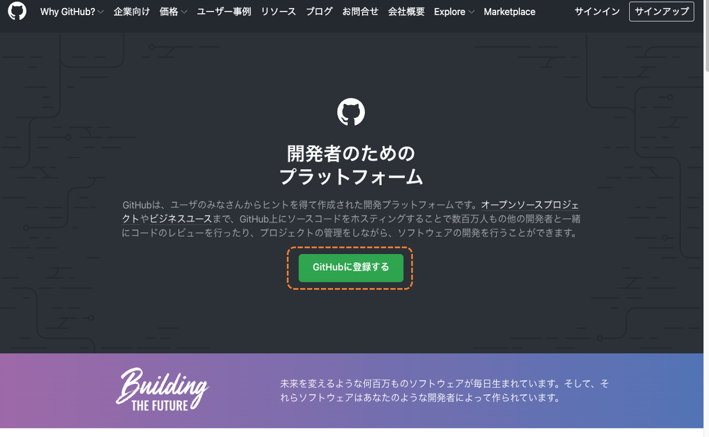

 

アカウント作成に必要な項目を入力します。
 

    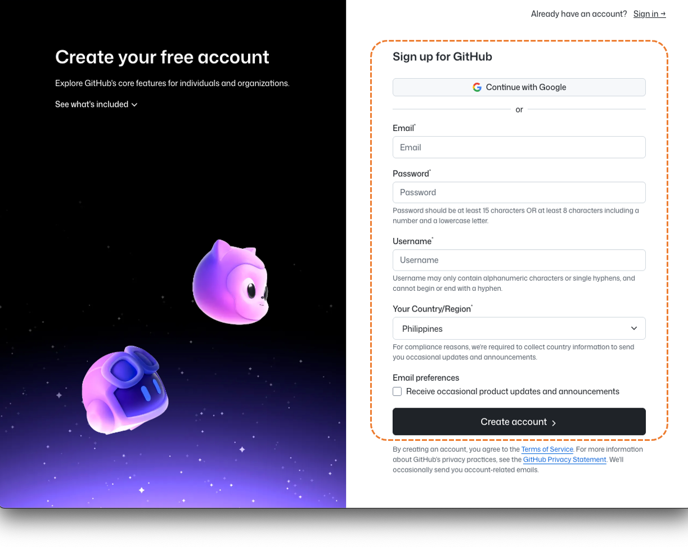

 

入力したメールアドレスに届いたコードを入力します。
 

    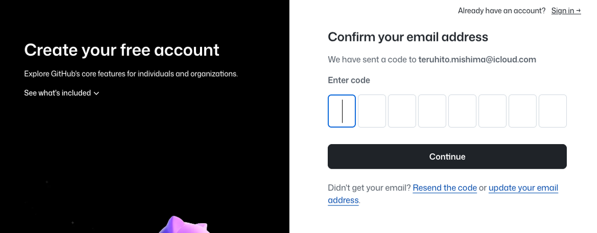

 

サインインします。
 

    

 

#### 6.6.2 zmk-smatrixリポジトリをフォークする
 **ご自身のGitHubにサインインした後**、検索ボックスに `misshii3/zmk-smatrix` を入力
 

    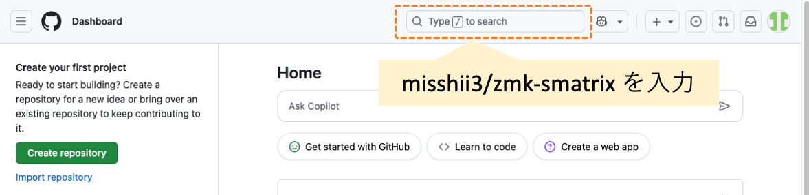

 

`misshii3/zmk-smatrix`を選択する
 

    

 

「Fork」の右の「▼」を選択し、「+ Create a new fork」を選択する
 

    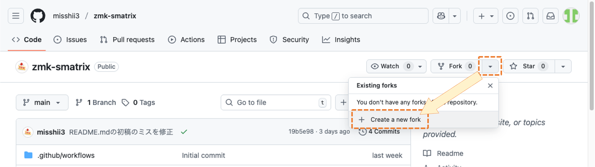

 

「Create a new fork」ボタンを選択する。\
これで、あなたのGitHubアカウントに`zmk-smatrix`が、フォーク（コピー）されます。
 

    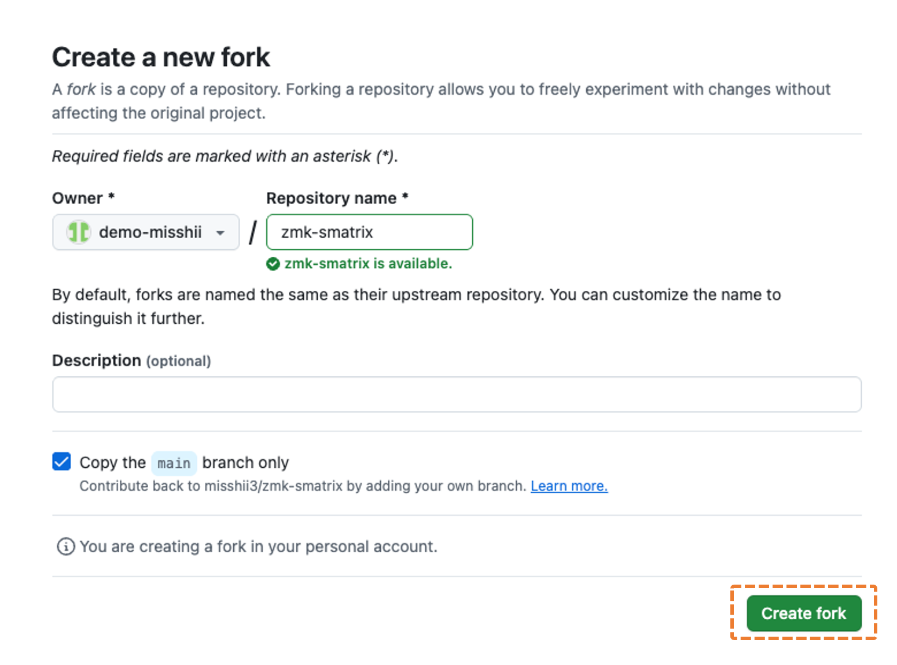

 

#### 6.6.3 ファームウェアをビルドする
「Actions」を選択する
 

    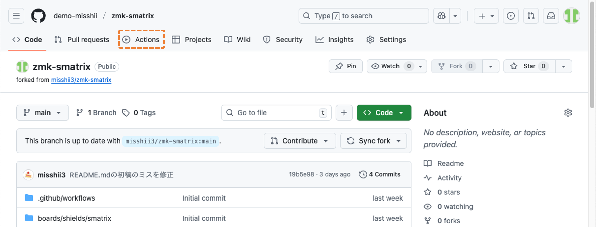

 
ファームウェアビルドを行うため、ワークフローを有効にする必要があります。
「I understand my workflows, go ahead and enable them」ボタンを選択します。
 

    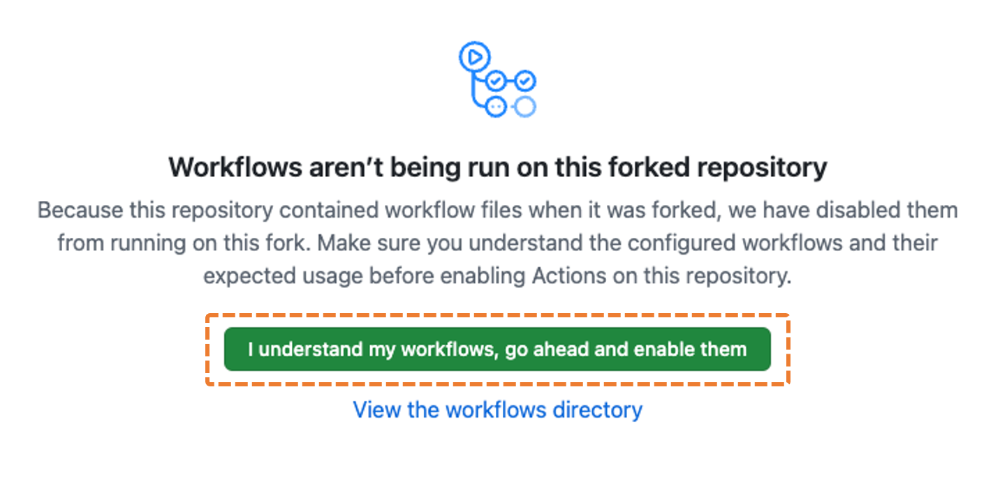

 

「.github/workflows/build.yml」を選択します。
 

    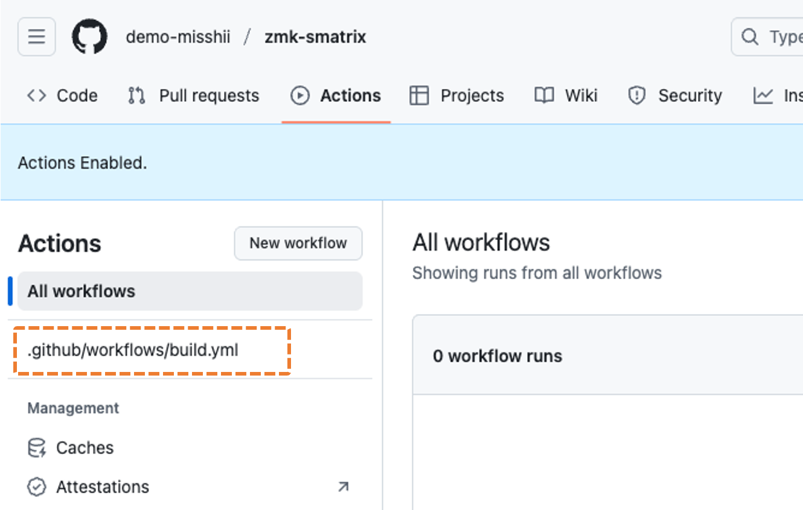

 

「Run workflow ▼」ボタンを選択し、「Run workflow」ボタンを選択します。これにより、ファームウェアのビルドが開始されます。
 

    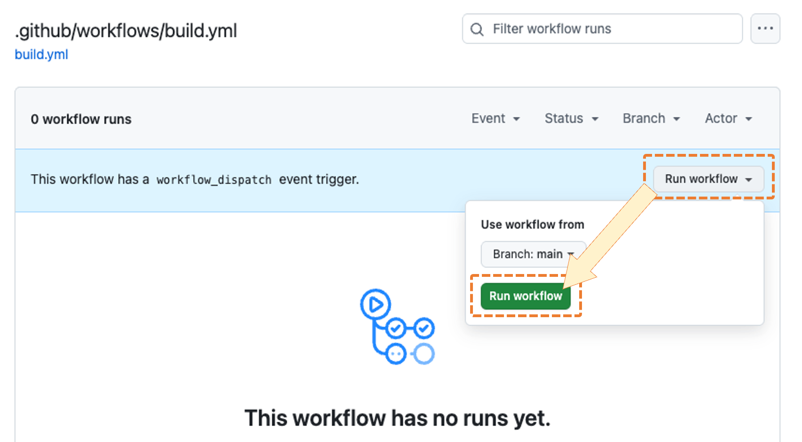

 

ビルド中を示す「黄色のアイコン」が3分〜7分程度表示されます。\
※ビルド時間は、都度変化します。
 

    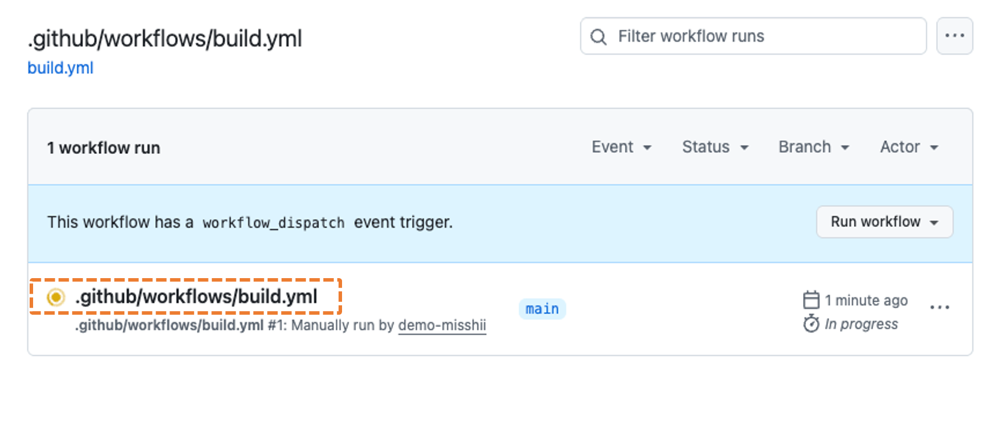

 

ビルドが完了すると「緑色のチェックアイコン」が表示されます。\
「.github/workflows/build.yml」を選択してください。
 

    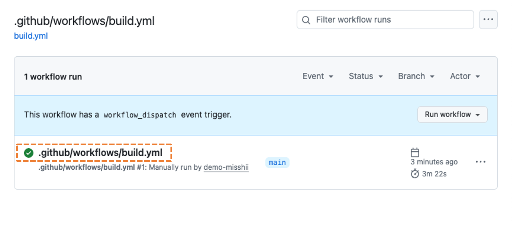

 

## 6.7 ファームウェアを書き込む
 

#### 6.7.1 ファームウェアのダウンロード、ファイルの解凍
下側の「firmware」の右の、「ダウンロードアイコン」を選択します。\
ビルドされたファームウェアがPCにダウンロードされます。
 

    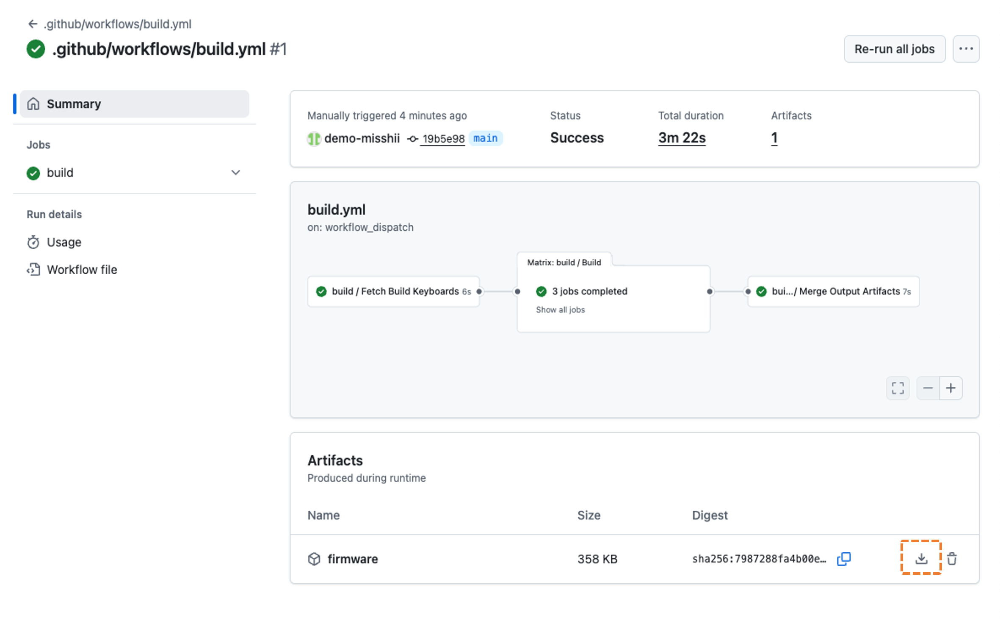

 

ダウンロードした`firmware.zip`を解凍すると3つのファイルに展開されます

- settings_reset... リセット用ファイル
- smatrix_left... 左手用ファームウェア
- smatrix_right... 右手用ファームウェア
 

    

 

#### 6.7.2 マイコンにファームウェアを書き込む

##### 6.7.2.1 書き込み順序の説明
  - 左手側は、セントラル(親)として、PC/タブレット等と通信します。
  - 右手側は、ペリフェラル(子)として、セントラルと通信します。
  - 右手側(子) → 左手側(親)の順序で書き込むことでトラブルが減ります。
  - 仮に、左手側(親) → 右手側(子)の順序で書き込んだ場合、分割キーボードとして動作せず「片手キーボード」として認識されたままになることがあります。
  - 問題が発生した場合は、右手側(子) → 左手側(親)の順序で書き込んでみてください。
 

##### 6.7.2.2 先に右手側(子)のファームウェアを書き込む
まず、PCと右手側をUSBケーブルで接続します。
 

  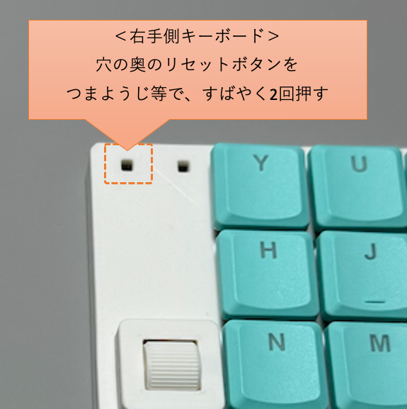

   すると「XIAO-SENSE」(Macの場合：NO NAME)というドライブがPC上に表示されます。

1. `settings_reset...` というファイルを、表示されたドライブにドラッグ＆ドロップしてください。

2. ファイル転送が完了すると「XIAO-SENSE」が一度消えます。  
   もう一度リセットボタンをすばやく2回押してください。  

3. 再び表示された「XIAO-SENSE」（Macの場合：NO NAME）に対して、`smatrix_right...` ファイルをドラッグ＆ドロップしてください。

**Macの場合**  
転送時にエラーメッセージが出ることがありますが、問題ありません。  
そのままウィンドウを閉じて次の操作に進んでください。
 

    

 

##### 6.7.2.3 左手側(親)のファームウェアを書き込む
右手側のUSBケーブルを外し、PCと左手側をUSBケーブルで接続します。
 

  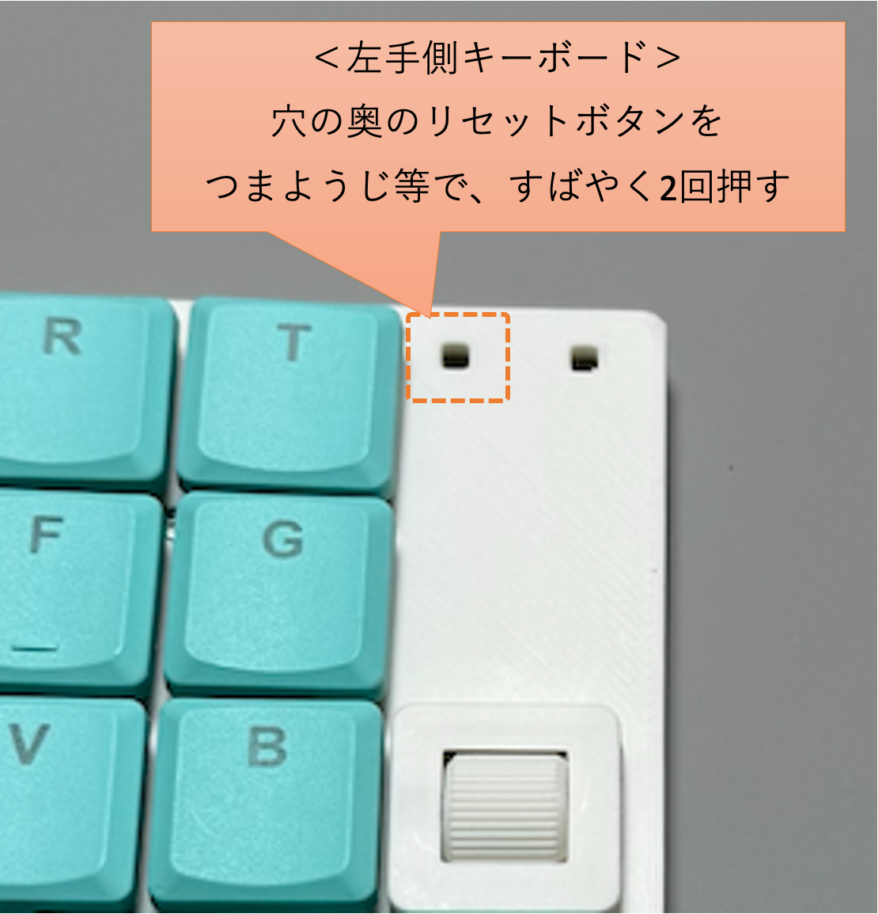

 
   すると「XIAO-SENSE」(Macの場合：NO NAME)というドライブがPC上に表示されます。

1. `settings_reset...` というファイルを、表示されたドライブにドラッグ＆ドロップしてください。

2. ファイル転送が完了すると「XIAO-SENSE」が一度消えます。
   もう一度リセットボタンをすばやく2回押してください。  

3. 再び表示された「XIAO-SENSE」（Macの場合：NO NAME）に対して、`smatrix_left...` ファイルをドラッグ＆ドロップしてください。

 

## 6.8 PCとの接続

#### 6.8.1 Bluetooth接続
- SplitMatrix50の左右ともスライドスイッチONにしてください。
- すでにペアリング済みの場合、ペアリングを削除してからデバイスを追加してください
 

    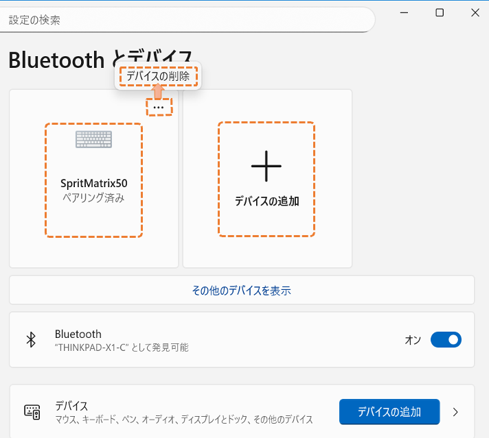

 

#### 6.8.2 USB接続
USB接続の場合、左手側（親）をPCとUSB接続しますが、右手側（子）は左手側（親）と無線接続されます。
- SplitMatrix50のBluetooth接続を切断してください。
- SplitMatrix50の右手側（子）のスライドスイッチはONにしてください。
- SplitMatrix50の左手側（親）のスライドスイッチはOFFでも、USB接続により、左右のキーボードを使用することができます。スライドスイッチONで充電が行われます。

#### 6.8.3 キー入力確認
SplitMatrix50のキーを押下し、PCでキー入力が可能か確認してください。
 

## 6.9 KeymapEditorでキーマップ編集
- キーマップ編集を行うため、[KeymapEditor](https://nickcoutsos.github.io/keymap-editor/)を活用します。KeymapEditorにより、ブラウザのみで視覚的にキーマップを編集できます。
なお、Remap等と異なり、キーマップを反映するためにはファームウェアのビルド/書き込みが必要です。
 

#### 6.9.1 GitHubアカウントにKeymapEditorを接続

- [KeymapEditor](https://nickcoutsos.github.io/keymap-editor/)を表示し、「GitHub」を選択します。
 

    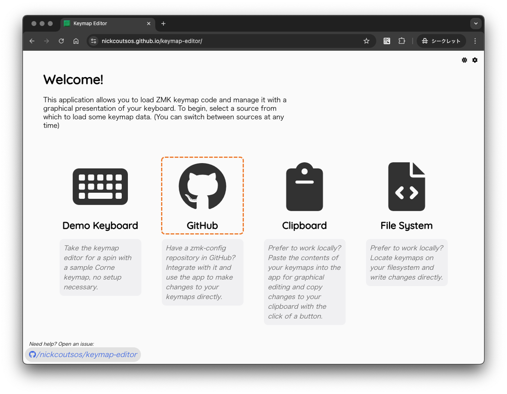

 

#### 6.9.2 GitHubにログイン
- GitHubにログインしてください。
 

    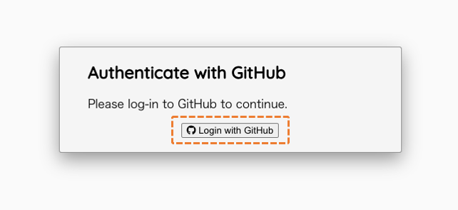

  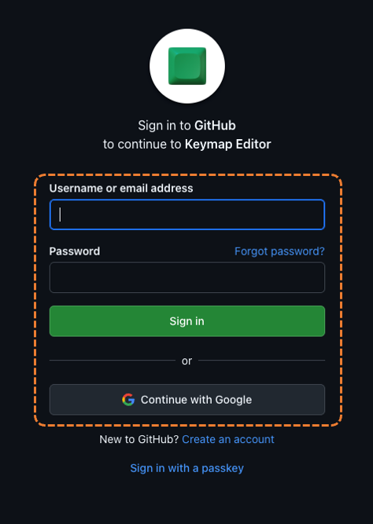

 

- GitHubにKeymapEditorの接続を承認するため、「Authorize Keymap Editor」ボタンを選択します。
 

  

 

- 「Add Repository」ボタンを選択します。
 

    

 

- 「Only select repositories」→「Select repositories」→「zmk-smatrix」を選択します。
 

  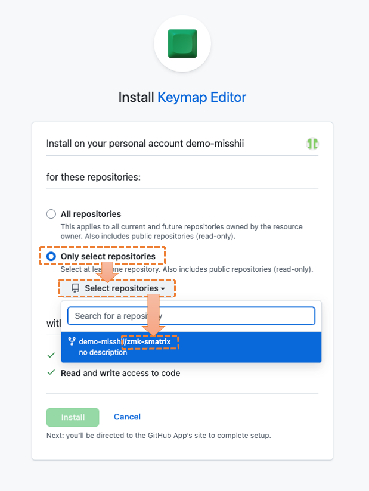

 

- 「Install」を選択します。
 

  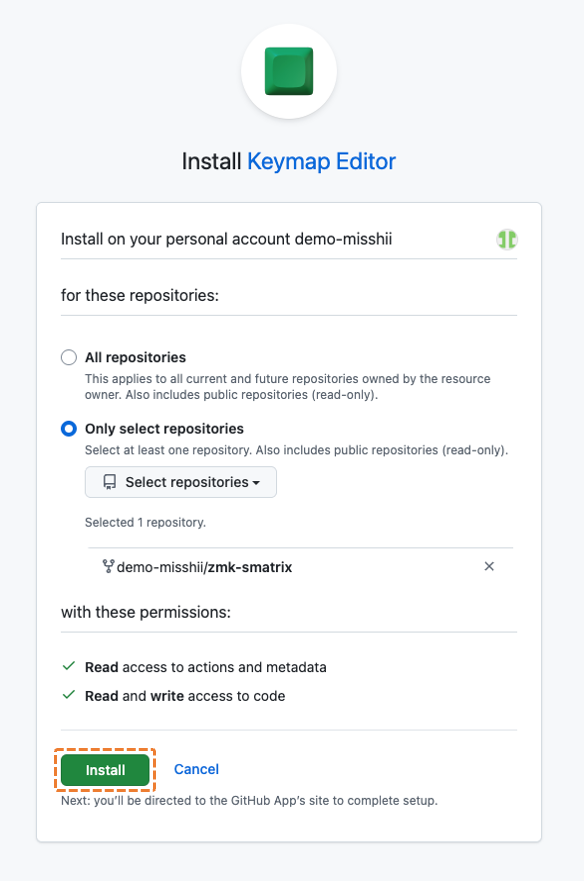

 

- ここまでの操作により、KeymapEditorがあなたのGitHubアカウントに接続されました。
- これで、あなたのGitHubリポジトリ`zmk-smatrix`のキーマップを、KeymapEditorで編集することができます。

 

#### 6.9.3 キーマップを編集する
- お好みのキーマップに編集してください。
- [繊細ガジェットレビューさんの記事](https://sensai-gadget.com/keymap-editor-usage/)がとても参考になります。

##### 6.9.3.1 （参考）デフォルトのキーマップ
- Layer 0：デフォルトレイヤー、Windows用
  - 補足
    - Zの下：Windowsのスクリーンショット
      - マクロ：Win + Shift + S
    - 左ローラーボリューム押下（Bの右）：Teams等のマイクミュート
      - マクロ：Win + Alt + K
    - 右ローラーボリューム押下（Nの左）：Layer 1（Macレイヤー）に切り替え
 

    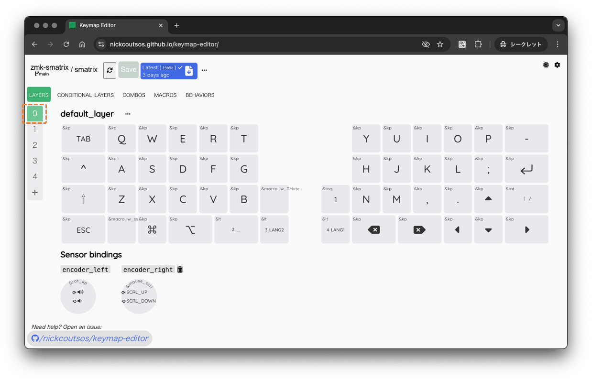

 

- Layer 1：Mac用のレイヤー
  - 補足
    - Zの下：Macのスクリーンショット
      - マクロ：Command + Shift + 4
    - 右ローラーボリューム押下（Nの左）：Layer 0（Windowsレイヤー）に戻す
 

    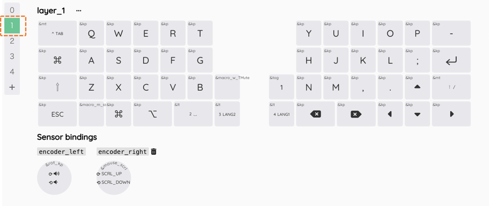

 

- Layer 2：記号のレイヤー
 

    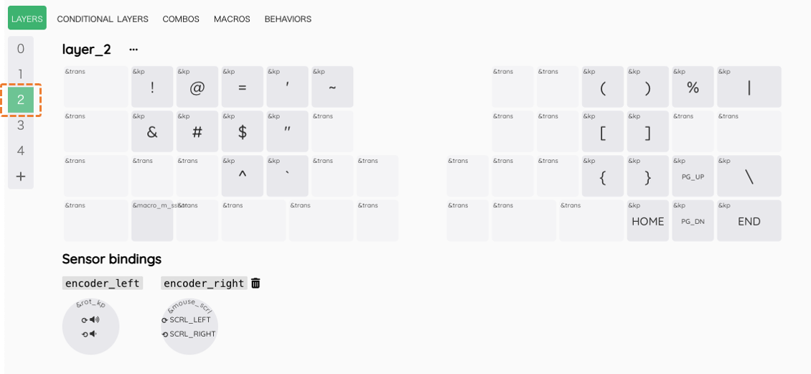

 

- Layer 3：数字、算術記号などのレイヤー
 

    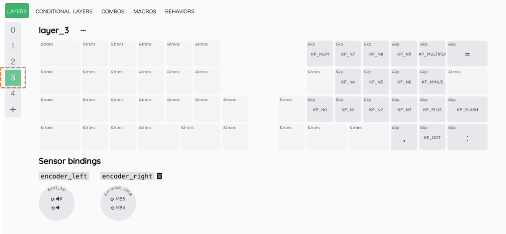

 

- Layer 4：Bluetooth切り替え、ファンクションキーのレイヤー
 

    

 

#### 6.9.4 キーマップ保存と、ファームウェアのビルド
- キーマップを編集したら、「Save」ボタンを選択してください。設定が保存され、自動的にファームウェアがビルドされます。ビルド時間は3分〜7分程度
- 「Save」ボタンの右の「青いボタン」を選択すると、ファームウェアのダウンロード画面に遷移します。
- ファームウェアをダウンロードし、キーボードに書き込むことで、キーマップ変更が反映されます。
 

    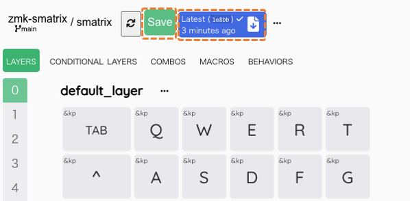

 

---

# 7. 注意事項

この「注意事項」には、本製品をご使用になるお客様および他の人々への危害や財産への損害を未然に防止するために、守っていただきたい事項を記載しています。  

## 7.1 表示の説明

- **【危険】** この表示は「人が死亡または重傷※1や傷害※2を負う可能性が想定される内容、および物的損害※3の発生が想定される内容」を示しています。  

※1「重傷」とは、失明・けが・やけど（高温・低温）・感電・骨折・中毒などで後遺症が残るもの、または治療に入院や長期の通院を要するものを指します。  
※2「傷害」とは、治療に入院や長期の通院を要さない、けが・やけど（高温・低温）・感電などを指します。  
※3「物的損害」とは、機器、設備、家屋・家財・および家畜・ペットにかかわる拡大損害を指します。  

## 7.2 【危険】
- お客様に別途ご用意頂くリチウムポリマー電池のコネクタには極性（プラス極とマイナス極）があり、本製品と合わない場合があります。コネクタを接続する前に、必ず極性を確認してください。
- 極性が合わないリチウムポリマー電池を接続しないでください。
- 異常（発熱・におい・煙・異音）が起きたら直ちに使用を中止してください。
- 充電中は放置せず、常に目の届く場所で充電してください。
- 落下・投げつけなどの強い衝撃を与えないでください。  
- 高温となる場所（火のそば、暖房器具のそば、こたつの中、直射日光の当たる場所、炎天下の車内）での使用や放置はしないでください。  
- 水や液体をかけないでください。濡れた手で使用しないでください。  
- 指定以外の入力電圧では使用しないでください。  
- 改造はしないでください。  
- お客様による修理はしないでください。  
- 変形や傷がある場合は使用しないでください。  
- 接続端子や内部回路をショートさせないでください。異物（金属片・鉛筆の芯など）が触れないようにしてください。  
- 釘を刺す、ハンマーで叩く、踏みつけるなどしないでください。  
- ケーブルを抜く際は必ず製品とケーブルを持って水平に引き抜いてください。  
- 小さなお子様や乳幼児の手の届く場所に置かないでください。  

---

# 8. 免責事項

- 地震・雷・風水害などの天災および当社の責任以外の火災、第三者による行為、その他の事故、お客様の故意または過失・誤用・その他異常な条件下での使用により生じた損害に関して、販売者は一切の責任を負いません。  
- 本製品の使用または使用不能から生じる付随的な損害（記録内容の変化・消失、事業利益の損失、事業の中断など）に関して、販売者は一切の責任を負いません。大切な電話番号やデータは、控えておかれることをおすすめします。  
- 本書の記載内容を守らないことにより生じた損害に関して、販売者は一切の責任を負いません。  
- 当社が関与しない接続機器との組み合わせによる誤動作などから生じた損害に関して、販売者は一切の責任を負いません。  
