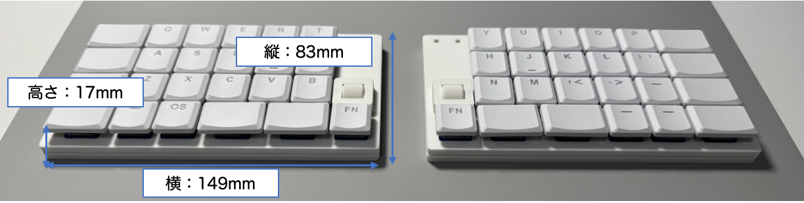
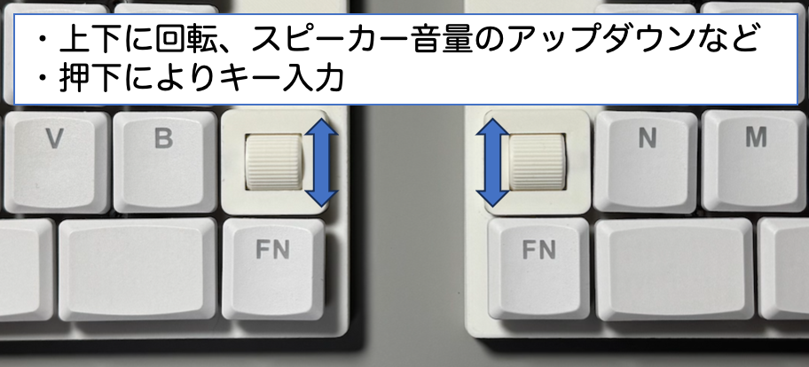
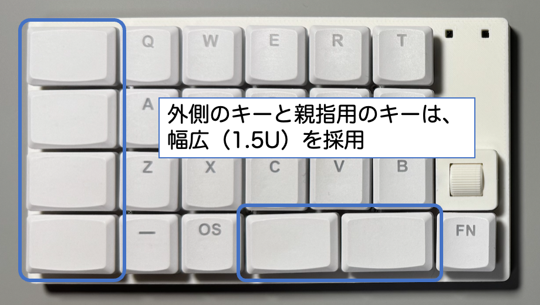
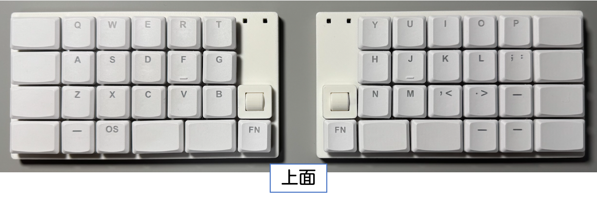
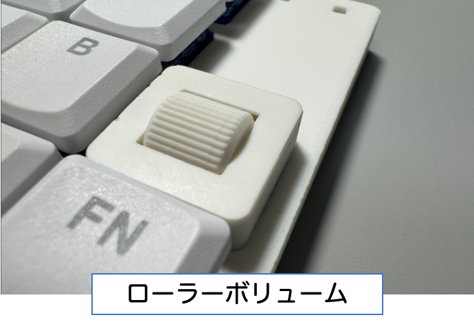
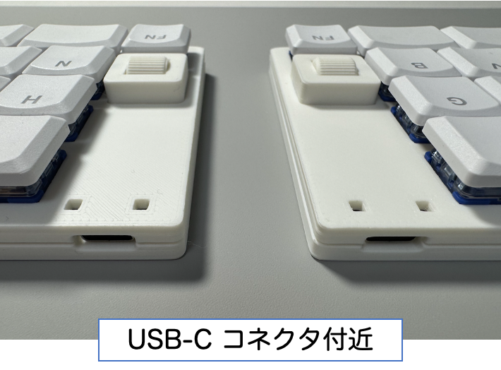
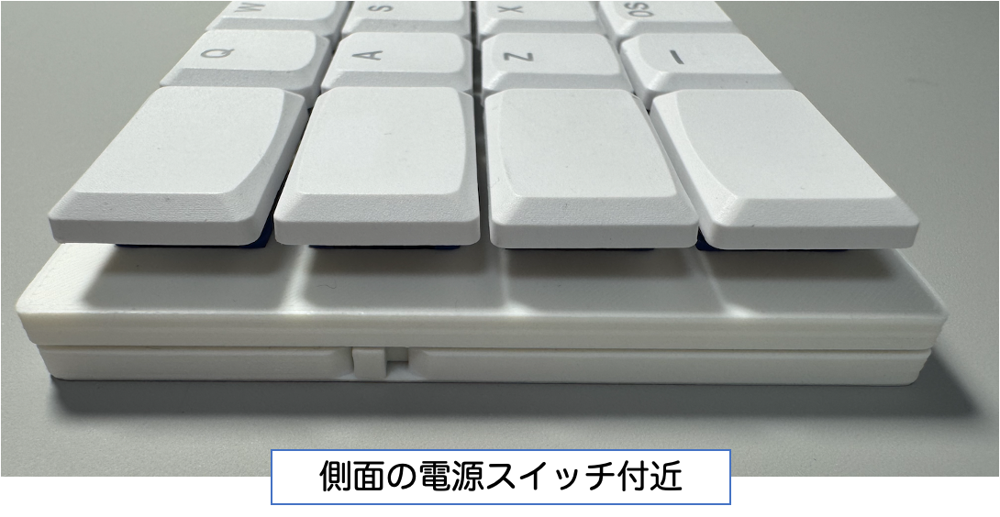

# SplitMatrix50 について
SplitMatrix50 は、左右分割とオーソリニア配列のワイヤレス50キー自作キーボードです。はんだ付け不要の簡単組み立て。薄型・軽量でデスクもカバンもすっきり、ローラーボリュームで音量などを直感的に操作できます。
  

    

 

- [目次](#目次)
    - [特徴](#特徴)
    - [商品写真](#商品写真)
    - [仕様](#仕様)
    - [商品に含まれるもの](#商品に含まれるもの)
    - [別途ご用意が必須なもの](#別途ご用意が必須なもの)
    - [キーマップの変更手順](#キーマップの変更手順)

 

## 特徴

- スイッチとキーキャップとバッテリーを取り付けてネジ止めするだけの簡単組み立てキットで、はんだ付け作業は不要です
 

- キーが整然と並ぶオーソリニア配列（直交配列）
 

- 左右分割により、ラクな姿勢でタイプできます
 

- PCとキーボードの接続、左右接続も無線のため、デスクやカバンがスッキリ
 

- 薄型、小型軽量、ケーブル不要なので、スマートに持ち運びができます

    

 

- 50キーにより、60％キーボードからの移行が比較的スムーズ
  - 50キーには、ローラーボリューム押下のスイッチ2キーを含みます
 

- ローラーボリュームの上下回転により、直感的なボリューム操作ができます。また、キースイッチを内蔵しています。マイクミュートなどのショートカットキーを割り当てると便利です

    

 

- 外側キーを幅広(1.5U)にしています。親指用も幅広(1.5U)にすることで、姿勢のブレによるミスタイプを防ぎます

    

 

### 商品写真

    
    
    
    
    

 

### 仕様

|項目|内容|
|---|---|
|対応キースイッチ|Kailh Choc V2|
|対応キーキャップ|CherryMX互換ロープロファイルキーキャップ|
|推奨キーキャップ|THT(Tai-Hao Thins) Low Profile Keycaps MX 1U×36個、1.5U×12個|
|サイズ|縦:83mm 横:149mm 高さ:17mm（高さは推奨キーキャップ装着時）|
|参考重量|262g（キースイッチ・推奨キーキャップ・バッテリーを含む）|
|キーピッチ|19mm|
|キーボード本体のカラー|マットホワイト|
|無線方式・接続台数|Bluetooth5.0(Bluetooth Low Energy)、最大5台まで|
|バッテリー持続期間|150mAhの場合、3〜4週間（利用状況により変化します）|
|内蔵マイコン|Seeed XIAO BLE nRF52840|
|ファームウェア|ZMK Firmware|
|その他|ボディやパーツは家庭用3Dプリンターで印刷しているため、積層痕や若干の個体差・表面の粗さが生じます。|

 

### 商品に含まれるもの
- キーボード本体（左手用、右手用を含む）
- 滑り止めシート（キーボード裏側への貼り付け用）
 

### 別途ご用意が必須なもの
- キースイッチ（Kailh Choc v2）×48個
- CherryMX互換ロープロファイルキーキャップ　1U×36個 、1.5U×12個
- 3.7V リチウムポリマー電池×2個（実測で縦35mm以下、横18.5mm以下、厚み4mm以下、JST 1.25コネクタ付のもの）
- USB-Cケーブル
- 精密プラスドライバー
 

### キーマップの変更手順
- 鋭意作成中です